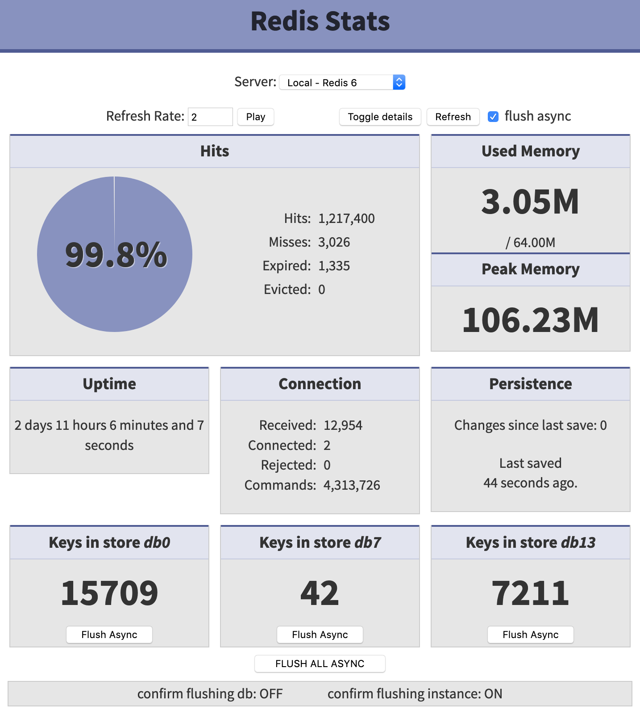

# redis-stats

[](screenshot.png)


**Disclaimer**: This is a fork of **[tessus/redis-stats](https://github.com/tessus/redis-stats)** and provides a Docker image based on lightweight **[Trafex/docker-php-nginx](https://github.com/TrafeX/docker-php-nginx)**.

* Ready-to-use image is available from the **[Docker Hub](https://hub.docker.com/r/l33tlamer/redis-stats)** registry. Currently `amd64` only.

* When used without environment variables or config file, a default of "127.0.0.1:6379" will try to be used.

* For a single Redis instance, supply the environment variables `$REDIS_NAME`, `REDIS_HOST` and `REDIS_PORT` to overwrite the default.

* For multiple Redis instances, do not use the variables but instead mount `config.php` to `/var/www/html/config.php` in the container.

* The `config.php` file can be downloaded from the repo here as template or copied out of the container:
* * `docker cp redis-stats:/var/www/html/config.template.php ./config.php`

* Edit the config file to list **multiple Redis instances**, examples are also provided for usage with **socket**, and **user/password**.

Usage examples:

* `docker run -d --name redis-stats -p 8080:8080 l33tlamer/redis-stats`

* `docker run -d --name redis-stats -e -e REDIS_NAME=Redis REDIS_HOST=192.168.20.50 -e REDIS_PORT=6379 -p 8080:8080 l33tlamer/redis-stats`

* `docker run -d --name redis-stats -v config.php:/var/www/html/config.php -p 8080:8080 l33tlamer/redis-stats`

* For Docker Compose a `docker-compose.example.yml` file exists in the root of this repo.


*From the original redis-stat the update-checker and footer have been removed.*


# The following is the original README:


## Features

- lightweight
- no PHP redis module required
- connection via IP/port or socket
- password support (including Redis 6 ACLs)
- show details
- flush database (async support)
- flush instance (async support)
- command mapping support (when rename-command is used on the server)
- auto refresh
- check for update

## Installation

```
git clone --depth 1 https://github.com/tessus/redis-stats.git
cd redis-stats
cp config.template.php config.php
```

## Configuration

### Server information

Servers are defined as an array. There are a few examples in the `config.template.php` file.

Field     | Type          | Description
----------|---------------|------------------------------------------------------------------
Name      | string        | name shown in drop-down list (also used for command mapping)
IP/Socket | string        | IP address or socket (`unix://`) of the server
Port      | integer       | port of server, use -1 for socket
Password  | string, array | credentials for the server (optional)<br>string: `password`<br>array: `['user', 'password']` for Redis ACLs

e.g.:

```
$servers = [
	[ 'Local', '127.0.0.1', 6379 ],
	[ 'Local socket', 'unix:///var/run/redis.sock', -1 ],
	[ 'Local with password', '127.0.0.1', 6379, 'password_here' ],
	[ 'Local with user and password', '127.0.0.1', 6379, ['username', 'password_here'] ],
];
```

### Misc options

Name             | Default   | Description
-----------------|-----------|---------------------------------------------------------------
FLUSHDB          | true      | Show a 'Flush' button for databases
CONFIRM_FLUSHDB  | true      | Ask for confirmation before flushing database
FLUSHALL         | true      | Show a 'Flush All' button for the instance
CONFIRM_FLUSHALL | true      | Ask for confirmation before flushing the entire instance
STATUS_LINE      | "bottom"  | Position of status line: "bottom" or "top"
CHECK_FOR_UPDATE | true      | Show a 'Check for update' button
DEBUG            | false     | debug mode - you don't want to set this to true!

### Command mapping

In case commands have been renamed on the server, there's support to map these commands in the config file.

e.g.:

```
$command = [
	'Local'    => [         // must be a server name (first field in server array, name shown in drop-down list)
		'FLUSHDB'  => 'fdb-5dea06694ff64',
		'FLUSHALL' => 'fa-5dea067c9bbd6',
		'AUTH'     => '',
		'INFO'     => '',
	],
];
```

## Acknowledgements

I found the original script at https://gist.github.com/kabel/10023961

